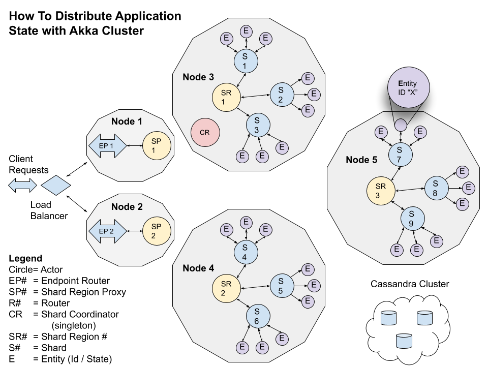

# How To Distribute Application State with Akka Cluster

Building, testing, containerizing, deploying, and monitoring distributed microservices is difficult, but using Lightbend technologies can make it a lot faster and easier to be successful.
In this four part blog series, we walk you through a working Proof of Concept (PoC) built using Lightbend’s open source distributed toolkit, Akka. This PoC delivers a resilient, highly performant, elastic, distributed, and consistent state solution that provides an automatic in memory cache with a persistent backing. Here is the breakdown:
- [Part 1](https://www.lightbend.com/blog/how-to-distribute-application-state-with-akka-cluster-part-1-getting-started) - Getting Started: we walk through building, testing, and running the PoC locally, with instrumentation and monitoring wired in from the very beginning using Lightbend Telemetry. 
- [Part 2](https://www.lightbend.com/blog/how-to-distribute-application-state-with-akka-cluster-part-2-docker-and-local-deploy) - Docker and Local Deploy: here we cover containerizing our PoC, and then deploying locally in Docker. Then, we’ll load test and monitor our PoC as we did in the first installment.
- [Part 3](https://www.lightbend.com/blog/how-to-distribute-application-state-with-akka-cluster-part-3-kubernetes-monitoring) - Kubernetes and Monitoring: in this part,we introduce Lightbend Console for Kubernetes (K8s), and then deploy our PoC in Minikube (desktop version of K8s) using YAML files provided in this repository. Again, we’ll load test with Gatling, but this time we’ll monitor our PoC in Lightbend Console.
- [Part 4](https://www.lightbend.com/blog/how-to-distribute-application-state-with-akka-cluster-part-4-the-source-code) - Source Code: In our final installment, we do a deep dive into our Scala source code.
 	
----------------
## Update November 21, 2022
- Migrate to the new Akka Platform 22-10, and specifically Akka 2.7, which bring a change to Akka's licensing. Lightbend moved the Akka license from Apache to [Business Source License](https://github.com/akka/akka/blob/main/LICENSE) (BSL) 1.1.

## Update September 19, 2022
- created a new branch (mread-multi-dc-common-journal), which supports Akka's Replicated Event Sourcing "Common Journal" running on Multi-Data Center / Microk8s and Yugabyte. README.md can be found [here](https://github.com/michael-read/akka-typed-distributed-state-blog-java/blob/mread-multi-dc-common-journal/microk8s-multi-dc/README.md).

## Update September 7, 2022
- update Akka related dependencies to latest
- Learned that `sbt` uses the env variable `JAVA_OPTS` to pass configs to Java whereas Maven w/ [Fabric8](https://github.com/fabric8io/docker-maven-plugin) uses `JAVA_TOOL_OPTIONS`.

## Update September 1, 2022
- Moved to Java 17: converted Actor Protocols and Events to Records
- Akka DNS cluster formation on Docker w/ Yugabyte. Doc [here](DOCKER_DNS_YUGABYTE.md).

## Update March 23, 2022
- Complete multi-node testing: integration tests for cluster formation, and gRPC, and http endpoints running under Maven.
- Upgrade Akka, Akka Http, and Akka gRPC to latest.
- multi-node testing defaults to Cassandra, but commenting change be changed to use Yugabyte instead.

## Update Feb 15, 2022
- This repository is the Java version of the original Scala version found [here](https://github.com/michael-read/akka-typed-distributed-state-blog).
- Testing [Lightbend's Akka Persistence Plugin for R2DBC](https://github.com/akka/akka-persistence-r2dbc).

## How to Generate Protobuf interfaces and stubs
```
mvn clean akka-grpc:generate
```

## Running a cluster locally with Cassandra

### Start the ElasticSearch Sandbox
[Elasticsearch developer sandbox](https://developer.lightbend.com/docs/telemetry/current/sandbox/elastic-sandbox.html#elasticsearch-developer-sandbox)

### Start Cassandra in Docker
````
docker-compose -f docker-compose-cassandra.yml up
````

### Start a cluster node
````
mvn compile exec:exec -Dapp.configfile="cluster-application.conf"
````

### Start a endpoint node
````
mvn exec:exec -Dapp.configfile="endpoint-application.conf"
````

## Running a cluster locally with Yugabyte

### Start the ElasticSearch Sandbox
[Elasticsearch developer sandbox](https://developer.lightbend.com/docs/telemetry/current/sandbox/elastic-sandbox.html#elasticsearch-developer-sandbox)

### Start Yugabyte in Docker
````
docker-compose -f docker-compose-yugabyte.yml up
````

### First time, create the tables
````
docker exec -i yb-tserver-n1 /home/yugabyte/bin/ysqlsh -h yb-tserver-n1 -t < https://raw.githubusercontent.com/akka/akka-persistence-r2dbc/main/ddl-scripts/create_tables_yugabyte.sql
````

### Start a cluster node
````
mvn compile exec:exec -Dapp.configfile="cluster-application-yugabyte.conf"
````

### Start a endpoint node
````
mvn exec:exec -Dapp.configfile="endpoint-application.conf"
````

## Running Multi-Node Tests
1. Start Cassandra first (above)
2. Start the test
````
mvn test
 ````
